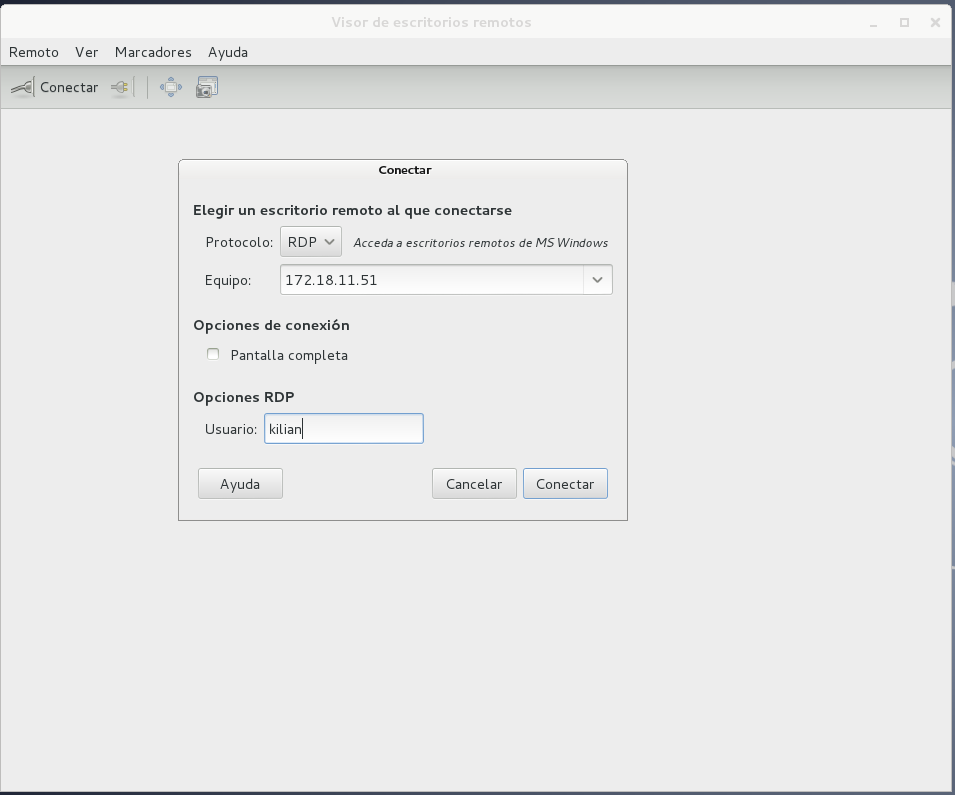
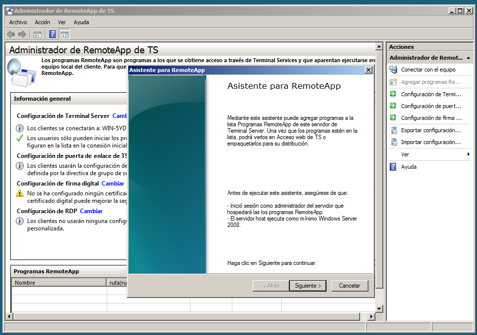
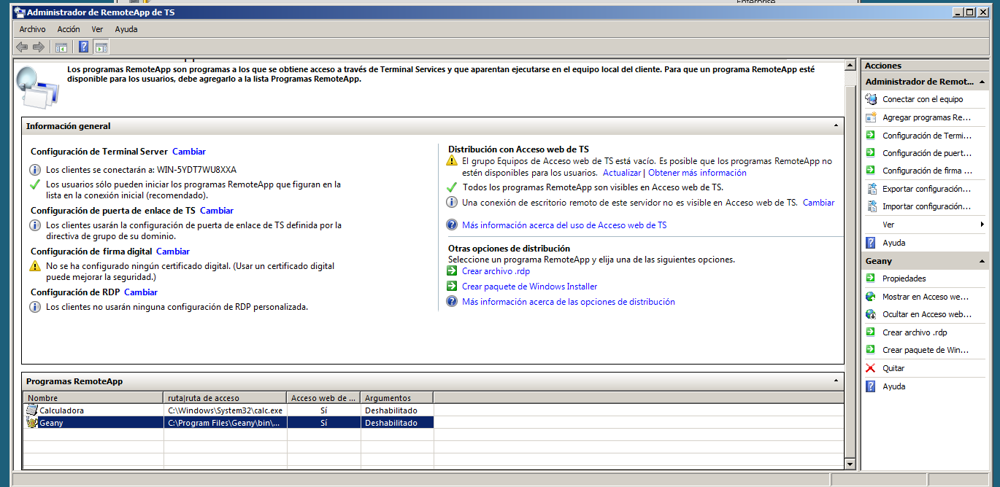
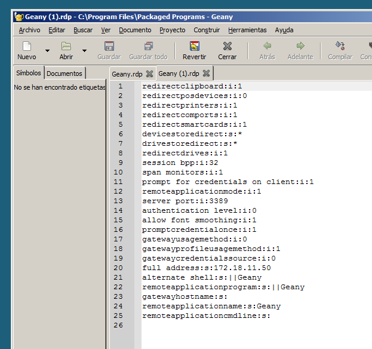

**ADD - Acceso Remoto:** *Kilian Manuel González Martín y Aarón González Díaz*

#Acceso Remoto (VNC, RDP y Terminal Server)

##Introducción

= Sistemas operativos para la práctica:

* Windows 7
* Windows Server 2008
* Debian 7 Wheezy

= Configuración de las máquinas virtuales:

No nos dimos cuenta, y pusimos unas IPs distintas, pero de cualquier modo se podrían cambiar rápido y funcionaria igual.

* Windows 7: 172.18.11.51 (PC Killian)

* Windows Server 2008: 172.18.11.50 (PC Kilian)

* Debian 7 Whezzy: 172.18.16.31 (PC Aarón)

##1. Escritorio remoto con VNC

###1.1 Descarga e instalación de VNC para Windows.

Lo primero que hicimos fue descargar el software necesario para usar VNC Servidor en Windows Server 2008 y Cliente en la máquina de Windows 7. En este caso hemos usado [RealVNC](http://www.realvnc.com/download/).

En el momento de descargar el software, nos pedirá aceptar los términos de licencia:

En el proceso de instalación de VNC Server, nos pedirá un serial, este nos lo proporcionará la web, al introducir los datos para descargar el software:

Después de aceptar términos, introducir el serial y otros pasos sencillos, procedemos a darle a Instalar.

Una vez instalado VNC Server, procedemos a activar el servicio en el panel de control de VNC, nos saldrá una pregunta de actualizaciones, por lo general conviene tenerlo actualizado.

**Nota:** *La instalación de VNC Viewer, que lo necesitaremos para más adelante, es aún más sencilla que la del server, y los primeros pasos de descarga son iguales.*

###1.2 Instalación y configuración de VNC en GNU/Linux Debian 7.

En el caso de esta distribución GNU/Linux, el servidor VNC ya viene instalado de forma predeterminada, pero si se trata de otra distro basada en Debian, el procedimiento a seguir será el siguiente:

Para instalar VNC Server, será con el paquete vino: $sudo apt-get install vino

Para activar VNC Server, se hace en el menú Aplicaciones - Herramientas del sistema - Preferencias - Compartición del escritorio:

Y activamos la opción "Permitir a otros usuarios ver mi escritorio", también sería prudente poner contraseña en "Requerir que el usuario introduzca una contraseña".

**Nota:** *En el caso del cliente VNC para GNU/Linux, podemos usar vinagre o remina, que también suele venir por defecto, si no, el procedimiento es el mismo: $sudo apt-get install vinagre.*

###1.3 Conectando máquinas con VNC.

* Acceder a Windows desde Windows

Para conectarnos a Windows desde Windows usando VNC, sería con el programa VNC Viewer, nos saldrá una ventana para conectarnos, donde debemos poner la ip o host de la máquina a la que queremos conectarnos, que llevará VNC Server:

Una vez hecho esto, le damos a aceptar y nos podremos conectar, nos saldrá una ventana nueva con el sistema del equipo al que nos estamos conectando:

* Acceder a Windows desde Linux

Para acceder a windows desde linux, usaremos el visor Vinagre en Debian 7, le damos al botón conectar, y ahí pondremos la ip de la máquina windows y la contraseña asignada:

Le damos a autenticar y nos saldrá la ventana con el sistema windows al que nos estamos conectando:

* Acceder a Linux desde Linux

Para acceder de Linux a Linux, hemos usado un LiveCD de Xubuntu para conectarnos a Debian, posteriormente en el LiveCD hemos instalado el vinagre. El procedimiento es igual de Linux a Windows:

Una vez nos conectemos nos saldrá un mensaje pidiendo autorización en Debian:

**Nota:** *Por algún motivo salen esos simbolos raros, debe de ser por el paquete de idioma incompleto en Debian, o por causa del LiveCD*

Una vez conectados:

* Acceder a Linux desde Windows

Para acceder de Linux desde Windows, hemos usado la herramienta VNC Viewer, y el procedimiento es igual que de Windows a Windows, al conectarnos, nos saldrá un mensaje pidiendo autorización de acceso al equipo que quiere conectarse a Debian:

Una vez conectados:

##2. Escritorio remoto con RDP

###2.1 Instalación y configuración de RDP en Windows.

En Windows, el protocolo remoto que usa por defecto es el RDP, y este ya viene instalado por defecto en la mayoría de veces, si no es así el caso, se puede agregar en: "Panel de Control - Añadir y quitar programas y Agregar características de windows".

Para activar el servicio hay que ir a: "Equipo - Propiedades de Equipo - Configuración avanzada del sistema - Acceso Remoto", y activamos donde pone **"Permitir conexiones de Asistencia remota a este equipo"**.

**Nota:** *Para usar el cliente o visualizador de RDP en windows, usaremos la herramienta "Conexión a Escritorio Remoto", que viene en windows.*

###2.2 Instalación y configuración de RDP en Linux.

A pesar de que RDP es propio del sistema Windows, este también se puede instalar en GNU/Linux y usarlo en modo servidor de igual manera.

Para instalar RDP en GNU/Linux, en el caso de base Debian y derivadas, es a través del paquete xrdp de la siguiente manera: **$sudo apt-get install xrdp**.

Si usamos Ubuntu con Unity o Gnome, nesesitaremos iniciar en modo clásico de Gnome, para ello hay un paquete que se llama **Gnome-session-falback**, para instalarlo el procedimiento será el mismo de antes: **$sudo apt-get install gnome-session-falback**.

El siguiente paso es configurar la sesión de gnome en el inicio en **/home/user/.xsession**, para que este inicie con esa sesión.

Ahora el siguiente paso, es definir en la configuración del servicio de XRDP, para que este coja por defecto el archivo .xsession, la configuración de XRDP está en: **/etc/xrdp/startwm.sh**.

Lo próximo es iniciar el servicio xrdp, para que puedan conectarse a nuestra máquina, con el comando: **$sudo /etc/inid.d/xrdp start** o también si este ya estaba iniciado, **$sudo /etc/init.d/xrdp restart**.

Y el sistema ya estaría listo para que se conecten remotamente con RDP a el.

**Nota:** *Como cliente RDP en GNU/Linux, podemos usar Vinagre, Remina o Rdesktop...etc, el procedimiento para instalarlos es el mismo*

###2.3 Conectando máquinas con RDP.

* Acceder a Windows7 desde Windows Server

Una vez tengamos activado el escritorio remoto en windows7, para poder conectarnos a el desde windows server, vasta con usar la misma herramienta predeterminda de "Conexión a Escritorio Remoto", la abrimos e ingresamos la ip y usuario y contraseña de la máquina a la que queremos conectarnos.

Una vez conectados:

* Acceder a Windows7 desde Linux

Para acceder a Windows desde Linux mediante el protocolo RDP, vasta con usar uno de los clientes que hemos nombrado anteriormente para GNU/Linux, en este caso hemos usado **Vinagre**. Lo abrimos y le damos al botón conectar, y allí ingresamos la ip y usuario y contraseña de la máquina que queremos asistir.

Una vez conectados:

* Acceder a Linux desde Windows7

Una vez instalado y configurado xrdp en GNU/Linux, ya pueden conectarse a nuestra máquina con clientes windows. En windows usaremos el cliente por defecto de "Conexión a Escritorio Remoto", el procedimiento será el mismo que de windows a windows.

Una vez conectados en la ventana de login ponemos modulo="vnc-any", ip="ip-de-la-máquina-Linux".

Una vez realizada la conexión:

##3. Escritorio remoto con Terminal Server

###3.1 Instalación y configuración de Terminal Server en Windows Server 2008.

La conexión de escritorio remoto con Terminal Server usa el mismo RDP que en el caso anterior, con la diferencia de que Terminal Server es con usuarios y contraseñas definidos en el servidor. De tal forma que cada usuario podrá acceder al mismo tiempo sin necesidad de cerrar sesión.

Pasos a seguir para la instalación de Terminal Server en WinServer 2008:

* Es necesario tener el SO actualizado para poder realizar la instalación de los componentes de forma correcta. Por lo que actualizaremos el servidor y volvemos a desactivar las actualizaciones automáticas de Windows Update.

* En W2k8server RC2, Terminal Service tiene un nombre diferente. Para instalarlo hay que hacer lo siguiente: Panel Administrativo -> Agregar roles -> Servicio de Escritorio Remoto -> Host de Sesión de Escritorio Remoto.

Paso 1: Agregando Terminal Server en Roles y Características.

Paso 2: Agregando servicios de función de Terminal Server.

Paso 3: Configurando método de autenticación.

Paso 4: Configurando el modo de licencia.

Paso 5: Agregando grupos de usuarios para Terminal Server.

Paso 6: Confirmación de instalación de Terminal Server.

**Nota:** *Al finalizar este servicio, tendremos que reiniciar Windows Server 2008, para que se apliquen los cambios.*

###3.2 Configurando usuarios de Terminal Service.

Para que se puedan contectar a WinServer2008 mediante Terminal Service, hay que definir los usuarios y el grupo para la conexión remota.

Creando usuarios locales:

* Abrir Administrador de. servidor -> Configuración -> Usuarios locales y grupos.

* Crear varios usuarios. Por ejemplo, usar los nombres en minúsculas de los miembros del grupo.

* Añadir usuarios al grupo de acceso remoto.

Paso 1: Añadiendo usuarios.

Paso 2: Agregando grupo de conexión remota a usuarios:

Vamos a propiedades del usuario -> Pestaña Miembro de y le damos a agregar.

Le damos a opciones avanzadas y agregados el grupo Usuarios de Escritorio Remoto y le damos a aceptar.

Paso 3: Agregando usuarios de escritorio remoto, en las opciones de activar escritorio remoto.

**Nota:** *A parte hemos creado los usuarios aaron y kilian y le hemos hecho el mismo procedimiento.*

###3.3 Conectando máquinas con Terminal Server.

* Conectando a Windows Server desde Windows Cliente con Terminal Server.

Después de instalar y configurar el Terminal Server en Windows Server 2008, procedemos a conectarnos a el desde un Windows7, mediante la misma conexión remota predeterminada de windows.

Ingresamos la ip, el usuario y contraseña, y nos saldra un aviso de certificado, ya que habíamos activado los certificados en Terminal Server:

Una vez conectados:

**Nota:** *Para conectarnos de Windows a Windows, hemos usado el usuario aaron simultáneamente con kilian que lo usaremos en el siguiente.*

* Conectando a Windows Server desde Linux con Terminal Server.

Sin desconectarnos del cliente windows con el usuario aaron, procedemos a conectarnos desde linux, pero ahora con el usuario kilian simultáneamente.

Abrimos vinagre e ingresamos la ip, usuario y contraseña.

Una vez conectados:

##4. Aplicaciones remotas mediante RemoteApp

###4.1 Instalación y configuración de RemoteApp

RemoteApp es una manera sencilla de conectarnos remotamente solo a aquellas aplicaciones que sean necesarias, sin necesidad de dar asistencia remota de todo el sistema.

El servidor RemoteApp, lo instalaremos y configuraremos en el Windows Server 2008, los pasos a seguir son los siguientes:

Paso1: Vamos a la herramienta Sistema. Para ello, haga clic en Inicio y en Ejecutar, escriba control system en el cuadro Abrir y, a continuación, haga clic en Aceptar.

En Tareas, haga clic en Configuración de Acceso remoto, y seguimos el asistente de RemoteApp:

Elegimos los programas que queremos que tengan asistencia remota:

Finalizamos el asistente, nos dará un resumen de lo que hemos configurado.

**Nota:** *A parte de agregar la calculadora en RemoteApp, también hemos agregado el programa Geany, que no es propio del sistema y no se encuentra en el cliente.*

###4.2 Conectando máquinas mediante RemoteApp con RDP

La conexión la haremos desde el Cliente Windows7 a Windows Server 2008, lo haremos con el programa Geany que está instalado en el Servidor.

Paso 1: Una vez creado el archivo de configuración, lo pasamos al cliente para poder conectarnos a esa app remota.

Paso 2: Verificamos que el archivo de la app remota sea correcto con las rutas.

Paso 3: Abrimos el archivo en el cliente, y le damos a aceptar en la confirmación de asistencia remota.

Paso 4: Nos preguntará por el usuario y contraseña a poner para la asistencia remota de la aplicaciones, ponemos usuario y contraseña y le damos a aceptar.

Paso 5: Una vez abierto el programa geany de forma remota.

##5. Conclusiones

###5.1 VNC

VNC es un protocolo para conexión remota de código libre, normalmente este se implementa por defecto o es recomendado en GNU/Linux, pero que también se puede hacer uso de el en Windows, tanto para hacer conexiones:

* Linux desde Linux

* Windows desde Linux

* Linux desde Windows

* Windows desde Windows

El software usado en esta práctica para VNC en Windows ha sido [Realvnc](http://www.realvnc.com/download/viewer/), tanto servidor como visualizador cliente. 
Y en Linux han sido **Vino** como servidor y **Vinagre y Remmina** como visualizadores clientes.

###5.2 RDP

RDP es un procotolo de conexión remota propietario de Microsoft, y este es el implementado de forma nativa en máquina Windows. En GNU/Linux se puede instalar mediante el paquete **xrdp**, que nos hará de servidor RDP en Linux, como visualizadores clientes RDP hemos usado: 
**Vinagre y Remmina**.

###5.3 Terminal Server

Terminal Server es un método de autentificación más seguro que el base RDP, este requiere de usuario y contraseña con certificación para la autenticación. Y la única dificultad añadida que hemos encontrado, era simplemente el agregar los usuario para tal fin, en Administración de Equipos -> Usuario y Grupos.

###5.4 RemoteApp

RemoteApp, un método para conectarnos remotamente solamente a una app en específico, ideal para no dar el control de todo el sistema. Las dificultades que hemos es con el netbios y los certificados, simplemente hemos puesta la propia ip del servidor donde pone nombre, y desactivado los certificados.

